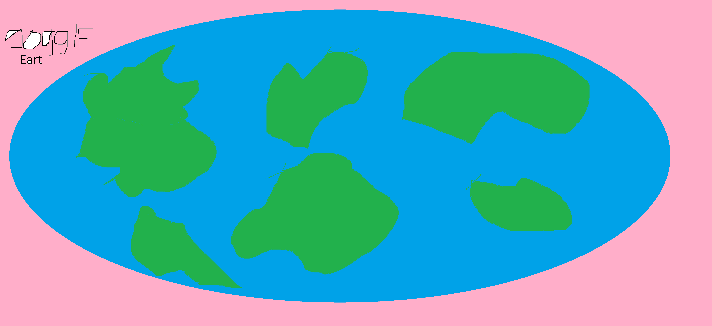

# BlueMarble Map

Emscripten:
cd external/emsdk
./emsdk install 3.1.45
./emsdk activate 3.1.45
source ./emsdk_env.sh

cd ../../
export EMSDK_NODE=/usr/bin/node (fallback)
export EM_NODE_JS=$(which node) (system?)
mkdir build_web
cd build_web
emcmake cmake ..
cmake --build .

copy ExampleImgui.html to bin folder (cant compile it, old version) 

python -m http.server 8080 (in bin folder)
